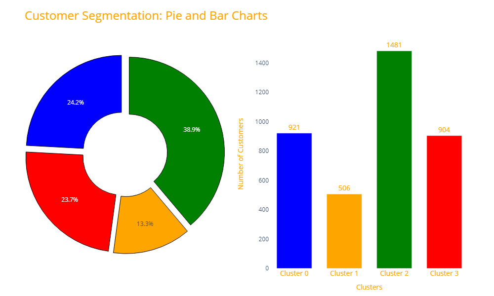
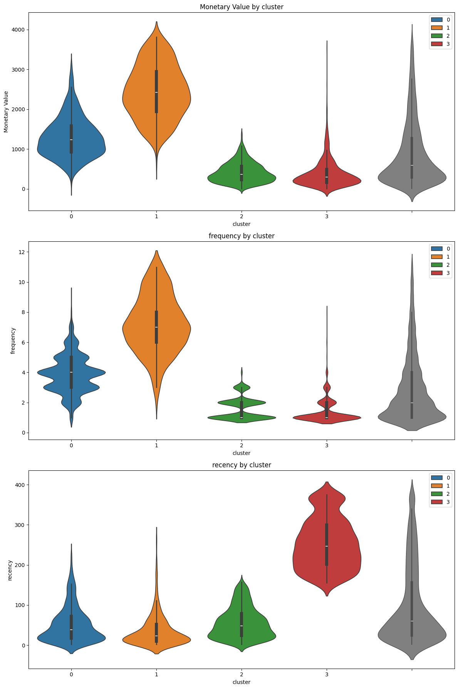
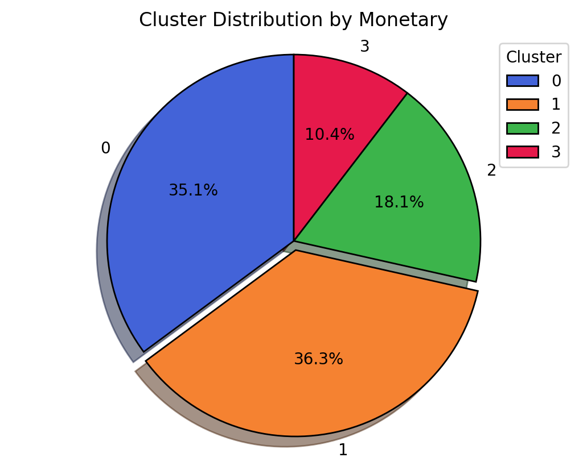
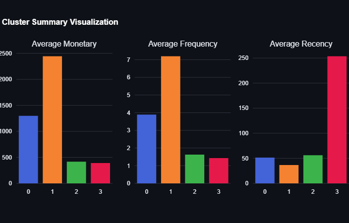

# Customer Clustering Project

This project uses customer transaction data from the [Online Retail II dataset](https://archive.ics.uci.edu/dataset/502/online+retail+ii) from the UCI Machine Learning Repository to cluster customers based on their purchasing behavior.

## Project Overview

The goal of this project is to segment customers using unsupervised machine learning techniques. By grouping customers based on purchasing patterns, businesses can better understand customer behavior and tailor marketing strategies to each group.
you can access the project on streamlit 

### Dataset

The dataset contains a variety of features related to online retail transactions, including:
- **Invoice**: Unique identifier for each transaction.
- **StockCode**: Product codes.
- **Description**: Product descriptions.
- **Quantity**: Quantity of each product per transaction.
- **InvoiceDate**: Date and time of the transaction.
- **Price**: Price per unit of each product.
- **Customer ID**: Unique customer identifier.
- **Country**: Customer’s country of residence.

The dataset is downloaded from the [UCI Machine Learning Repository](https://archive.ics.uci.edu/dataset/502/online+retail+ii) and placed in the `data` folder within this repository.

### Methods

The project leverages the following steps:

1. **Data Preprocessing**: Cleaning the dataset by removing missing values and irrelevant features.
2. **Feature Engineering**: Creating customer-level features such as total spending, frequency of purchases, and recency.
3. **Clustering**: Using KMeans clustering to group customers based on their purchasing behavior.
4. **Evaluation**: Analyzing the clusters to extract business insights.

### Key Libraries Used
- `Pandas` for data manipulation.
- `Matplotlib` and `Seaborn` for data visualization.
- `Scikit-learn` for KMeans clustering and evaluation.
- `YData Profiling` for quick dataset profiling.

### Cluster Analysis
 
#### 1. **Cluster 0 (Blue)**: **"Moderate-Value, Infrequent, Active Recency"**     
   **Suggested Actions**:  
   - **Upsell and Cross-Sell**: Leverage mid-level promotions or recommend complementary products to increase their spending.
   - **Maintain Engagement**: Send reminders or product recommendations to keep them engaged and increase the frequency of purchases.

---

#### 2. **Cluster 1 (Orange)**: **"High-Value, High Frequency, Recent"**  
   **Suggested Actions**:  
   - **Loyalty Programs**: Introduce exclusive deals and loyalty rewards to retain this valuable segment.
   - **Personalized Marketing**: Focus on personalized campaigns and exclusive offers to enhance customer experience.

---

#### 3. **Cluster 2 (Green)**: **"Low-Value, Low Frequency, Active Recency"**  
   **Suggested Actions**:  
   - **Educational Campaigns**: Use awareness campaigns to inform them about products and promotions.
   - **Incentivize Engagement**: Implement bundle offers or small discounts to increase purchase frequency and boost their average spending.

---

#### 4. **Cluster 3 (Red)**: **"Low-Value, Infrequent, Very Inactive Recency"**
   **Suggested Actions**:  
   - **Reactivation Campaigns**: Utilize re-engagement discounts or personalized emails to understand why these customers became inactive.
   - **Surveys & Feedback**: Conduct surveys to gather insights on their disengagement and identify areas for improvement.

### Cluster Visualization
 
 

---

### Key Takeaways
- **Cluster 1 (Orange)** is the primary segment to focus retention strategies on, as they have high value and recent engagement.
- **Cluster 0 (Blue)** represents a stable customer group that could be targeted for upselling or increasing frequency.
- **Clusters 2 and 3 (Green and Red)** require efforts to increase engagement and spending, especially Cluster 3, which needs reactivation strategies.

These insights can guide data-driven marketing strategies and resource allocation for customer management.

## Future Work

Future enhancements may include:
- Work on outliers in the data.
- Testing other clustering algorithms such as DBSCAN or Hierarchical Clustering.
- Incorporating additional features for more complex customer segmentation.
- Building a customer recommendation system based on the clusters.

[presentation](https://www.canva.com/design/DAGS4L9d94g/cZaYy6N6jybaLr0lYJNyGQ/edit?utm_content=DAGS4L9d94g&utm_campaign=designshare&utm_medium=link2&utm_source=sharebutton)